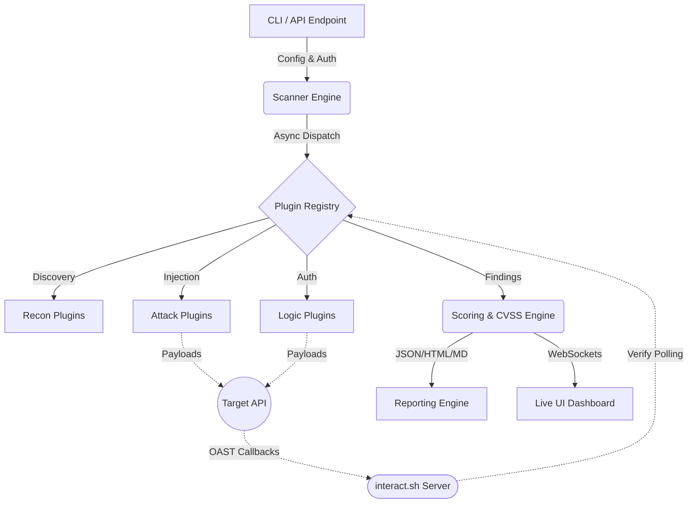

<div align="center">

# 🔐 API Security Scanner Pro — Enterprise Edition

[](https://python.org)
[](https://opensource.org/licenses/MIT)
[](https://github.com/psf/black)
[](https://www.docker.com/)

A high-performance, asynchronous vulnerability scanner built specifically for modern REST and GraphQL APIs. 
Uncover critical flaws like IDOR, BOLA, SSRF, JWT bypasses, and SQL Injections before attackers do.

</div>

---

## 🔥 Features

* **⚡ Natively Asynchronous Engine:** Powered by `httpx` and `asyncio` for blazing fast concurrent scanning.
* **📡 OAST (Out-of-Band) Integration:** Default integration with `interact.sh` to capture blind vulnerabilities (RCE, SSRF, Blind SQLi).
* **🧠 Advanced Confidence Scoring:** Minimizes false positives by calculating granular confidence scores based on logic and variance analysis, automatically grading using **CVSS 3.1** vectors.
* **🛡️ Self-Protection & Guardrails:** Built-in WAF fingerprinting, SSRF-blocking on private IPs, and smart internal rate limiting to prevent DoS against target systems.
* **🔄 Hot-Reload Plugins:** Uses `watchdog` to automatically reload checking modules, enabling you to write and debug custom security tests on the fly.
* **🌐 Enterprise Dashboard:** Beautiful real-time tracking interface built with Tailwind CSS, interacting natively via WebSockets and FastAPI.
* **📄 Multi-Format Reporting:** Generates actionable, polished reports in HTML, JSON, Markdown, and SARIF for CI/CD integration.

---

## 🏗️ Architecture Flow



---

## ⚙️ Instalação (Local)

Siga os passos abaixo para preparar o ambiente e instalar todas as dependências do projeto:

1. **Clone o repositório:**
```bash
git clone https://github.com/barakinha4-ui/api-security-scanner-pro.git
cd api-security-scanner-pro
```

2. **Instale as dependências:**
```bash
pip install -r requirements.txt
```

3. **Verifique a instalação do CLI:**
```bash
python src/apiscanner/cli.py --help
```

---

## 🐋 Execução via Docker (Recomendado)

O projeto já inclui um ambiente nativo orquestrado para isolar o Scanner e hospedar o Dashboard estático em seu servidor local.

1. **Copie as variáveis de ambiente:**
```bash
cp .env.example .env
```

2. **Suba o Dashboard e o Container base (Nginx):**
```bash
docker compose up -d
```
> O Dashboard estará acessível em: `http://localhost:8080/index.html`

3. **Inicie o CLI do Scanner diretamente pelo Docker (Os relatórios cairão na pasta ./reports física):**
```bash
docker compose run --rm scanner --target https://api.exemplo.com --scan full --output reports/auditoria.html
```

---

## 🚀 Usage Guide

A arquitetura modular permite flexibilidade entre verificações super-rápidas ou testes profundos autorizados.

**Auditoria Completa Básica**
```bash
python src/apiscanner/cli.py --target https://api.vulnerable.com --yes --output report.html
```

**Modo Autenticado para Testes de IDOR / BOLA**
```bash
python src/apiscanner/cli.py -t https://api.site.com --scan api -a "Bearer xyz123" --output api_report.json
```

**Modo Stealth Anti-WAF**
```bash
python src/apiscanner/cli.py -t https://api.site.com --stealth --threads 5 --format md html
```

*Screenshots da versão CLI vs versão Dashboard podem ser inseridas aqui apontando os retornos coloridos de console e gráficos.*

---

## 🧩 Como adicionar Custom Plugins

A engine de `Hot-Reload` torna a criação de plugins super fácil, mesmo com a engine já rodando em background API.

1. Crie um novo arquivo `.py` na pasta `src/apiscanner/modules/`
2. Garanta que você importe a engine base e crie os checks assíncronos
3. Qualquer instância com decoradores de registro ou classes que herdam do BasePlugin serão injetados e rodarão automaticamente no próximo `scan_type`.

```python
from core.models import Finding
from core.plugins import Registry

@Registry.register("meu_plugin", description="Example custom logic")
async def check_custom_vuln(scanner_context):
    resp = await scanner_context.engine.get(f"{scanner_context.target}/admin")
    if resp.status == 200:
        scanner_context.report(Finding(title="Exposed Admin", endpoint="/admin", severity="HIGH"))
```

---

## 🗺️ Roadmap & Futuro

- [x] OAST nativo Integrado
- [x] Proteção anti-SSRF e loopbacks
- [x] Live Engine com WebSockets + FastAPI
- [ ] Exportação nativa de relatórios p/ formato SARIF (GitHub Actions)
- [ ] Integração com AWS / Cloudflare nativa para extração de logs
- [ ] SaaS wrapper + Fila de Background workers Celery.

---

## 📊 Load Testing (Performance & Scalability)

The SaaS Scanner Pro includes a comprehensive load testing suite powered by **Locust** to validate performance under real-world conditions.

### User Personas
* **NormalUser (80%):** Light scans (1-3 ports), frequent status checks.
* **PowerUser (15%):** Heavy scans (10-20 ports), result polling, JWT auth.
* **AdminUser (5%):** Bulk job listing, exports, and Job cleanup.

### Performance Benchmarks
* **Target p95 Latency:** < 500ms (Status) / < 2000ms (Scan creation).
* **Target Error Rate:** < 1% at 50 concurrent users.

### Quick Start
1. **Install requirements:** `pip install locust fakeredis python-jose`
2. **Setup environment:** `cp .env.locust.example .env.locust`
3. **Run Smoke Test (Local):**
```bash
locust -f locustfile.py --headless -u 5 -r 1 -t 1m --host http://localhost:8000
```
4. **Run with Interactive UI:**
```bash
locust -f locustfile.py --host http://localhost:8000
```

---

## 📄 License

Este software foi desenhado para propósitos educacionais e testes de segurança em ambientes **autorizados**.
Distribuído sobre a licença MIT. Veja o arquivo `LICENSE` para mais detalhes.
